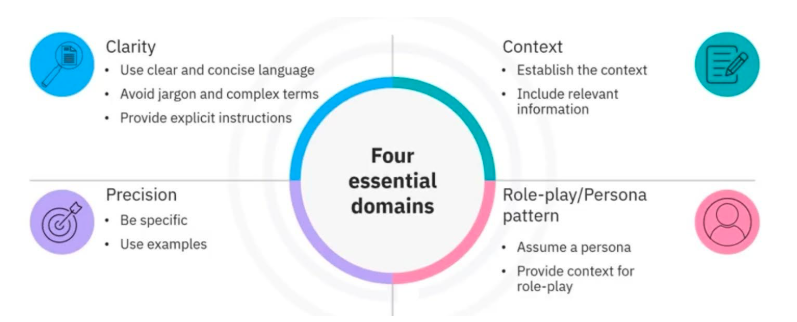

# A Short Guide to Prompting

Andre Moreira

This short guide on effective prompt engineering is designed to help you get the best results when interacting with AI models. By mastering the principles described here, you will be able to create prompts that produce clear, relevant, and accurate responses, regardless of the task at hand.

Image from IBM’s course "Generative AI: Prompt Engineering Basics" (Coursera).

### **1\. Clarity: Keep it Simple and Direct**

When creating prompts, always aim for clarity. This means using straightforward language that is easy to understand. The clearer the prompt, the more accurate the response will be.

- **Tip**: Avoid unnecessary jargon or overly complex terms.
- **Why**: If the language is too complicated, the model might interpret it incorrectly, leading to inaccurate or irrelevant responses.

**Example:**

- Unclear prompt: "Can you expound upon the ramifications of this theoretical concept?"
- Clear prompt: "Can you explain what this idea means in simple terms?"

---

### **2\. Context: Provide Relevant Background Information**

A well-crafted prompt should include all the necessary background information to guide the response. Without context, the model may provide generic or unrelated answers.

- **Tip**: Always include the details that the model needs to give a complete answer.
- **Why**: The more relevant context you provide, the more specific and useful the response will be.

**Example:**

- Prompt without context: "What does this formula mean?"
- Prompt with context: "In the context of physics, what does the formula E=mc² mean?"

---

### **3\. Precision: Be Specific and Use Examples**

Specific prompts yield more accurate and focused responses. Avoid vague instructions, and when possible, provide examples to help the model understand exactly what you want.

- **Tip**: Add clear instructions or examples if needed.
- **Why**: Being precise ensures the model understands the exact nature of the task, avoiding generic answers.

**Example:**

- Vague prompt: "Tell me about data science."
- Precise prompt: "Can you explain the steps involved in a data science project, starting from data collection to model evaluation?"

---

### **4\. Role-play/Persona Pattern: Assume a Role to Add Focus**

Sometimes it's helpful to take on a persona or role when crafting a prompt. This approach helps to give the model a specific lens through which to answer, ensuring a more targeted response.

- **Tip**: Assign the model a persona or role to help it focus on the context of the task.
- **Why**: Defining a persona can help guide the model to generate responses in a specific style or expertise area.

**Example:**

- No role-play: "What is quantum computing?"
- Role-play: "As a professor of theoretical physics, explain the basic concepts of quantum computing to a beginner."

---

### **Simple Everyday Tricks**

1. Prompts with multiple lines: Press \<Shift\> \+ \<Enter\> to create a line break. Press \<Enter\> to submit the prompt.

2. Short answers: ChatGPT often provides lengthy answers. To get concise responses, add “Short answer” at the end of your prompt.

3. Using screenshots: Whether capturing values from a table or text from an error message, ChatGPT 4 does a great job reading and interpreting screenshots.

4. “Challenge itself”: If you have a text or report generated by ChatGPT, copy it into a new chat and ask it to read it carefully, provide an appraisal, and suggest improvements. This is a great way to refine and enhance the output.

###

## Examples Prompt Combining All Four Domains

### Prompt: Travel guide to Paris

**Prompt**: "As a travel guide, can you clearly explain the best sights to see in Paris for a first-time visitor? Provide a list of 3 major attractions, along with a short explanation of each."

**Breakdown**:

- **Clarity**: The language is simple and direct.
- **Context**: You provide the situation (travel guide talking about Paris).
- **Precision**: The prompt asks for a list of 3 attractions, with an explanation for each.
- **Role-play**: The persona of a "travel guide" focuses the response in a specific direction.

**Result:**

_For a first-time visitor to Paris, these are three must-see attractions:_

1. **\*Eiffel Tower** – Iconic and synonymous with Paris, this iron structure offers stunning panoramic views of the city from its various levels. You can either take the elevator or climb the stairs for a more immersive experience. Visiting at sunset or seeing it sparkle at night is especially memorable.\*
2. **\*Louvre Museum** – Home to world-renowned artworks, including the Mona Lisa and the Venus de Milo, the Louvre is one of the largest and most famous museums globally. Even just walking around the glass pyramid entrance is an experience in itself, but if you enjoy art and history, set aside a few hours to explore inside.\*
3. **\*Notre-Dame Cathedral** – This magnificent Gothic cathedral is famous for its architecture, stained-glass windows, and gargoyles. While the interior is temporarily closed for renovation, walking around the exterior, visiting nearby Île de la Cité, and enjoying the view of the Seine is a must.\*

_These three sites offer a great mix of art, history, and iconic Parisian views for any first-time visitor._

### Prompt: Cooking Lesson

**Prompt**: "As a professional chef, can you clearly explain how to make a basic pizza dough? Provide step-by-step instructions suitable for beginners."

**Breakdown**:

- **Clarity**: Simple, easy-to-understand language.
- **Context**: The task is making pizza dough for beginners.
- **Precision**: Asks for step-by-step instructions, leaving no room for ambiguity.
- **Role-play**: The persona of a "professional chef" ensures the response has expertise in cooking.

**Result:**

_Here is a simple, step-by-step guide to making basic pizza dough:_

### **_Ingredients:_**

- _500g all-purpose flour (or bread flour)_
- _325ml warm water (not too hot, about 37°C)_
- _7g (1 packet) dry active yeast_
- _1 teaspoon sugar_
- _1 teaspoon salt_
- _2 tablespoons olive oil_

### **_Instructions:_**

1. **\*Activate the yeast**:\*  
   _In a small bowl, combine the warm water, sugar, and yeast. Stir gently and let it sit for 5-10 minutes. The yeast should become frothy and bubbly, which means it is active._
2. **\*Prepare the dry ingredients**:\*  
   _In a large mixing bowl, combine the flour and salt. Stir them together evenly._
3. **\*Combine wet and dry ingredients**:\*  
   _Once the yeast mixture is activated, pour it into the flour mixture. Add the olive oil at this stage as well. Mix everything together using a wooden spoon or your hands until it forms a sticky dough._
4. **\*Knead the dough**:\*  
   _Transfer the dough onto a clean, floured surface. Knead it for about 8-10 minutes, adding small amounts of flour if it becomes too sticky. The dough should become smooth and elastic. (You can test it by gently stretching a small piece—it should not tear easily.)_
5. **\*Let the dough rise**:\*  
   _Shape the dough into a ball and place it in a lightly oiled bowl. Cover it with a clean cloth or plastic wrap. Let it rise in a warm spot for 1 to 1.5 hours, or until it doubles in size._
6. **\*Shape the dough**:\*  
   _Once risen, punch down the dough to release the air. Divide it into 2 or 3 equal portions (depending on the size of pizzas you want). Roll or stretch each portion into a thin, circular pizza shape._
7. **\*Add toppings and bake**:\*  
   _Preheat your oven to its highest setting (around 250°C). Place the rolled-out dough on a baking tray or pizza stone. Add your sauce, cheese, and desired toppings. Bake in the preheated oven for 10-15 minutes, until the crust is golden and the cheese is melted._

_Enjoy your homemade pizza\!_

### Prompt: Scientific Explanation

**Prompt**: "As a physics professor, can you clearly explain the concept of gravity in simple terms suitable for a high school student? Use an example from everyday life."

**Breakdown**:

- **Clarity**: The language is simple and the instructions are direct.
- **Context**: Gravity is the concept to be explained, with the target audience being a high school student.
- **Precision**: Requests an everyday example to make the concept relatable.
- **Role-play**: The persona of a "physics professor" ensures an authoritative and clear explanation.

**Result:**

_Gravity is a force that pulls objects towards each other. The Earth pulls everything toward it, and that is why things fall when you drop them. This force is what keeps your feet on the ground and makes sure you do not float away._

_To explain it using an everyday example, imagine you are holding an apple in your hand. When you let go of the apple, it falls to the ground. This happens because the Earth pulls the apple towards it. Even though you do not feel it, the apple is also pulling on the Earth, but because the Earth is so much bigger and heavier than the apple, we only notice the apple falling._

_Gravity also keeps the planets, including Earth, orbiting around the Sun. The Sun's gravity pulls the planets toward it, but because they are moving, they do not crash into the Sun; instead, they keep moving in a curved path around it._

_In simple terms, gravity is like an invisible string that pulls objects toward each other, and it is what makes things fall and keeps us on the ground._

Follow these principles and you will achieve great results\!

Bonus example: when generating this short guide, I uploaded to ChatGPT the picture with the “four essential domains”, asked ChatGPT to “read” it for me; after that, I used the following prompt:

_I want you to play the role of a prompt engineering teacher. Based on what you just read, you will prepare a guide for beginners on how to achieve best prompting results. Follow the four essential domains. Provide examples._

This guide was the result, I only did minor adjustments.

For a more advanced guide on prompt engineering by Open AI, visit:  
[https://platform.openai.com/docs/guides/prompt-engineering](https://platform.openai.com/docs/guides/prompt-engineering)
